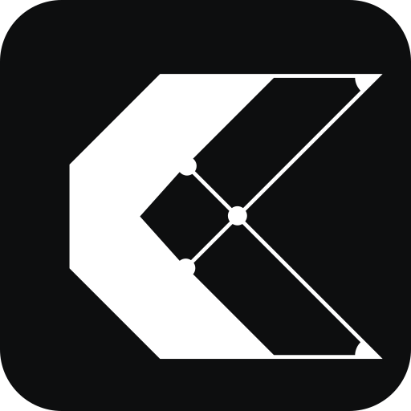

# Kolosal Vibes

AI-powered vibe coding platform - build web apps with natural language using Kolosal AI + Daytona Sandbox.



## Features

### Web Mode (Vibe Coding)
- **Natural Language to Web Apps** - Describe what you want, get a working web app
- **Live Preview** - See your app update in real-time as code is generated
- **Multi-Model Support** - Switch between AI models (Claude, Llama, MiniMax, Kimi, Qwen, GLM)
- **PWA Support** - Install as a desktop/mobile app
- **Responsive Preview** - Test on desktop, tablet, and mobile viewports

### CLI Mode
- **LLM Code Generation** - Generate code from natural language prompts
- **Safe Execution** - Execute code in isolated Daytona sandboxes
- **Auto-Fix** - Automatically retry and fix code errors (up to 3 attempts)
- **Multi-Language** - Support for Python, JavaScript, and Bash

## Prerequisites

- Python 3.10+
- Node.js 18+
- [Kolosal AI](https://kolosal.ai) API key
- [Daytona](https://daytona.io) API key

## Installation

1. Clone the repository:
```bash
git clone git@github.com:igun997/kolosal-vibe.git
cd kolosal-vibe
```

2. Create and activate virtual environment:
```bash
python3 -m venv venv
source venv/bin/activate  # Linux/Mac
# or
venv\Scripts\activate     # Windows
```

3. Install Python dependencies:
```bash
pip install -r requirements.txt
```

4. Install frontend dependencies:
```bash
cd frontend
npm install
cd ..
```

5. Configure environment variables:
```bash
cp .env.example .env
# Edit .env with your API keys
```

## Configuration

Create a `.env` file with the following:

```env
KOLOSAL_API_KEY=kol_your_api_key_here
DAYTONA_API_KEY=dtn_your_api_key_here
DAYTONA_API_URL=https://app.daytona.io/api
```

## Usage

### Docker (Recommended)

```bash
# Production mode
docker-compose up -d

# Development mode with hot reload
docker-compose --profile dev up
```

Open http://localhost in your browser (production) or http://localhost:5173 (dev).

### Manual Setup

Start the backend and frontend in separate terminals:

```bash
# Terminal 1: Backend
source venv/bin/activate
uvicorn app:app --reload --host 0.0.0.0 --port 8080

# Terminal 2: Frontend
cd frontend
npm run dev
```

Open http://localhost:5173 in your browser.

### CLI Mode

```bash
python main.py
```

#### CLI Commands

| Command | Description |
|---------|-------------|
| `/run <prompt>` | Generate and execute code |
| `/gen <prompt>` | Generate code only (no execution) |
| `/exec` | Execute the last generated code |
| `/lang <language>` | Change language (python, javascript, bash) |
| `/clear` | Clear conversation history |
| `/help` | Show help message |
| `/quit` | Exit the program |

## Project Structure

```
kolosal-vibe/
├── app.py                    # FastAPI entry point
├── main.py                   # CLI entry point
├── requirements.txt          # Python dependencies
├── .env.example              # Environment template
├── README.md
├── CLAUDE.md                 # AI assistant instructions
│
├── src/
│   ├── agent.py              # CodeAgent - CLI orchestrator
│   ├── llm.py                # Kolosal AI client (OpenAI-compatible)
│   ├── sandbox.py            # Daytona sandbox manager
│   │
│   ├── api/
│   │   ├── routes.py         # REST API endpoints
│   │   └── websocket.py      # WebSocket streaming
│   │
│   ├── sessions/
│   │   ├── manager.py        # Session lifecycle management
│   │   └── models.py         # Pydantic request/response models
│   │
│   └── web/
│       └── web_agent.py      # WebCodeAgent - web app generator
│
└── frontend/                 # React + Vite + Tailwind PWA
    ├── package.json
    ├── vite.config.ts        # Vite + PWA config
    ├── tailwind.config.js    # Kolosal brand colors
    ├── index.html
    │
    ├── public/
    │   ├── kolosal.svg       # Logo
    │   ├── kolosal-192.png   # PWA icon
    │   └── kolosal-512.png   # PWA icon
    │
    └── src/
        ├── App.tsx
        ├── main.tsx
        ├── index.css
        ├── types/index.ts
        ├── stores/store.ts   # Zustand state management
        │
        └── components/
            ├── Layout.tsx
            ├── Toolbar.tsx
            ├── ChatPanel.tsx
            ├── ChatMessage.tsx
            └── PreviewPanel.tsx
```

## How It Works

### Web Mode Flow

1. **Session Creation** - User opens app, Daytona sandbox spins up
2. **Chat Input** - User describes the web app they want
3. **AI Generation** - Kolosal AI generates HTML/CSS/JS code
4. **File Deployment** - Code is uploaded to sandbox
5. **Live Preview** - HTTP server serves the app in iframe
6. **Iterate** - User can refine with follow-up prompts

### CLI Mode Flow

1. **User Input** - User provides a natural language prompt
2. **Code Generation** - Kolosal AI generates code based on the prompt
3. **Sandbox Creation** - Daytona spins up an isolated sandbox
4. **Execution** - Code is uploaded and executed in the sandbox
5. **Error Handling** - If execution fails, LLM analyzes the error and generates fixed code
6. **Cleanup** - Sandbox is destroyed after use

## API Endpoints

| Endpoint | Method | Description |
|----------|--------|-------------|
| `/api/models` | GET | List available AI models |
| `/api/sessions` | POST | Create new session with sandbox |
| `/api/sessions/{id}` | GET | Get session status |
| `/api/sessions/{id}` | DELETE | Destroy session |
| `/api/chat` | POST | Send message (non-streaming) |
| `/api/preview/{id}` | GET | Get preview URL |
| `/api/files/{id}` | GET | List project files |
| `/api/files/{id}/{path}` | GET | Get file content |
| `/ws/{session_id}` | WebSocket | Streaming chat |

## Tech Stack

- **Backend**: FastAPI, Python 3.10+, Uvicorn
- **Frontend**: React 18, Vite, Tailwind CSS, Zustand
- **AI**: Kolosal AI (OpenAI-compatible API)
- **Sandbox**: Daytona SDK
- **PWA**: vite-plugin-pwa, Workbox

## API References

- [Kolosal AI API](https://api.kolosal.ai/docs) - OpenAI-compatible LLM API
- [Daytona SDK](https://github.com/daytonaio/sdk) - Sandbox management

## License

MIT
